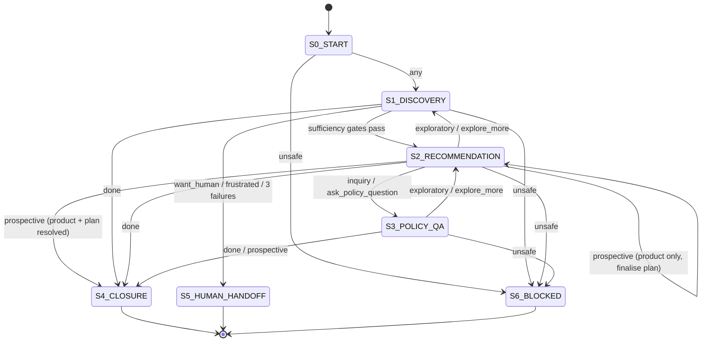

# Schema & State Definitions — Swasthya AI Insurance Sales Agent

> **Single source of truth** for the agentic workflow. Everything below is backed by code:
> - Attribute schema → [`attribute_glossary.py`](attribute_glossary.py) (`GLOSSARY`)
> - User state container → [`user_schema.py`](user_schema.py) (`UserSchema`)
> - Intents, states, transitions → [`fsm.py`](fsm.py) (`IntentSignal`, `INTENT_DEFINITIONS`, `FSMState`, `classify_intent`, `_next_state`)
> - Classifier prompts → [`prompts_template.py`](prompts_template.py) (`INTENT_CLASSIFIER_SYSTEM`)
>
> **Architecture principle:** state tracking, schema validation, retrieval filtering, and
> transitions are **deterministic Python**. The LLM is used only for *phrasing* and for
> *refining* intent classification — it never owns state or facts.
>
> **Channel assumption:** the agent is **voice-based**. There is no `channel` attribute —
> all phrasing targets a spoken call. Native-language handling (Hindi / English / Hinglish)
> is delegated to a separate translation agent (configured in phase 1); the `language`
> attribute drives it.

---

## 1. Schema layers

The glossary is organised into three layers. Each entry carries the same metadata keys
(`key, layer, type, label, description, valid_values, unit, nullable, hard_filter, ask_order,
question_text, example`).

| Layer | Count | Purpose |
|-------|-------|---------|
| `user` | 16 | What we learn about the buyer during discovery (11 askable + 5 analytics). |
| `policy` | 50 | Product-level attributes used to filter/score the 20 products (SP001–SP020). |
| `plan` | 9 | Tier-level attributes (sum insured, premium, OPD limit) for a chosen product. |

> A few keys appear in more than one layer (`gender` in user + policy; `opd_limit_inr` in
> policy + plan). Use `get_entry(key, layer=...)` to disambiguate — the optional `layer`
> argument was added so lookups never resolve to the wrong layer.

---

## 2. User schema — collected fields

The 11 **askable** fields are asked in `ask_order`. `hard_filter=True` means the value is used
as a strict eligibility gate during retrieval; otherwise it is a soft scoring signal.

| # | Key | Type | Hard filter | Valid values | Meaning |
|---|-----|------|:-----------:|--------------|---------|
| 1 | `buyer_type` | enum | ✅ | `individual`, `employer_large`, `employer_sme`, `gig_worker` | Who the cover is for. Gates group-only vs individual-only products. |
| 2 | `age` | int | ✅ | years | Applicant age. Gates age-banded products (e.g. SP009 18–35, SP006 60–80). |
| 3 | `gender` | enum | ✅ | `female`, `male`, `other` | Only relevant for female-only products (SP007, SP008); `other` ⇒ treated as `male`. |
| 4 | `primary_need` | enum | ✅ | `hospitalisation`, `critical_illness`, `cancer`, `accident`, `maternity`, `top_up`, `international`, `daily_cash` | Strongest product-pointing signal; 7 values map near-deterministically to a product. |
| 5 | `has_ped` | bool | — | `true` / `false` | Whether any pre-existing disease exists. Triggers the `ped_type` follow-up. |
| 5 | `ped_type` | enum | ✅ | `diabetes_cardiac`, `other_ped`, `none` | PED category; `diabetes_cardiac` points strongly to SP015. Asked only if `has_ped` is true. |
| 6 | `needs_opd` | bool | — | `true` / `false` | Whether routine OPD cover is wanted. Soft-eliminates hospitalisation-only products. |
| 7 | `budget_band` | enum | — | `micro`, `budget`, `mid`, `premium` | Annual premium guardrail (`micro` <₹2k → `premium` >₹30k). |
| 8 | `family_cover` | enum | — | `individual`, `floater_nuclear`, `floater_joint` | Who is on the policy; drives floater plan selection. |
| 8 | `family_size` | int | — | count | Number of members. Asked only if `family_cover` is a floater. |
| 9 | `si_preference` | enum | — | `1_2L`, `3_5L`, `10_25L`, `50L_plus` | Desired sum insured band; ranks plan tiers. |

### Analytics / housekeeping fields (not asked)

| Key | Type | Meaning |
|-----|------|---------|
| `session_id` | str | Conversation identifier. |
| `language` | str | Spoken language for the turn — `hindi`, `english`, or code-mixed `hinglish`. The agent is voice-based; a downstream translation agent (phase 1) uses this to address all three. |
| `conversation_stage` | enum | Mirror of the FSM stage (`info_gathering`, `recommendation`, `rag_open`, `closed`). |
| `drop_off_reason` | enum | Why a session ended without purchase (analytics). |
| `user_intent` | enum | The last classified `IntentSignal` (e.g. `prospective`, `inquiry`, `provide_info`). Analytics only — excluded from the LLM context so the model never sees its own intent label. |

---

## 3. Schema alignment — user ↔ policy

User fields and the policy attributes they are matched against. **Enum values are identical
across the two layers** wherever a direct comparison happens, which is what lets retrieval do
clean set intersections.

| User field | Policy attribute(s) | Match logic | Aligned? |
|------------|---------------------|-------------|:--------:|
| `buyer_type` | `buyer_types` (list) | `buyer_type ∈ buyer_types` | ✅ identical enum (4 values) |
| `age` | `entry_age_min`, `entry_age_max` | `entry_age_min ≤ age ≤ entry_age_max` | ✅ |
| `gender` | `gender` (`any` / `female_only`) | `female_only` requires `female`; `other` ⇒ `male` | ✅ documented mapping |
| `primary_need` | `primary_needs` (list) | `primary_need ∈ primary_needs` | ✅ identical enum (8 values) |
| `ped_type` | `waiting.ped_months`, `waiting.ped_months_diabetes_cardiac` | `diabetes_cardiac` rewards short diabetes/cardiac wait | ✅ soft score |
| `needs_opd` | `opd_covered`, `opd_limit_inr` | `needs_opd=true` ⇒ require/boost `opd_covered` | ✅ soft filter |
| `budget_band` | `budget_bands` (list) | `budget_band ∈ budget_bands` | ✅ identical enum (4 values) |
| `family_cover` | *(no direct policy field)* | Drives plan/floater selection, not product eligibility | ⚠️ plan-layer concern |
| `si_preference` | `plan.si_inr` | Band maps to an SI range; ranks plan tiers | ✅ via plan layer |
| `family_size` | `plan.si_inr` (floater sizing) | Influences recommended plan tier | ✅ via plan layer |

---

## 4. Policy schema — product attributes

### 4.1 Eligibility (hard filters)

| Key | Type | Meaning |
|-----|------|---------|
| `buyer_types` | list | Who can buy this product. |
| `gender` | enum | Gender restriction (`any` / `female_only`). |
| `entry_age_min` / `entry_age_max` | int | Eligible entry-age window. |
| `primary_needs` | list | Needs this product is designed to serve. |
| `international_cover` | bool | Whether hospitalisation outside India is covered. |

### 4.2 Coverage & benefits (soft scoring)

| Key | Type | Meaning |
|-----|------|---------|
| `budget_bands` | list | Premium budget bands the product's plans fall into. |
| `opd_covered` / `opd_limit_inr` | bool / int | OPD reimbursement and its annual cap. |
| `maternity_covered` / `maternity_day1` / `ivf_covered` | bool | Maternity, day-1 maternity, IVF cover. |
| `no_room_rent_cap` | bool | Whether a daily room-rent limit applies. |
| `copay_type` / `copay_pct` | enum / float | `none` / `flat_pct` / `age_based_pct` and the percentage. |
| `consumables_covered` | bool | Whether single-use consumables are paid. |
| `pre_hosp_days` / `post_hosp_days` | int | Pre/post-hospitalisation cover windows. |
| `domiciliary_covered` / `domiciliary_limit_inr` | bool / int | Home-treatment cover and its limit. |
| `restoration_type` | enum | How SI is replenished after exhaustion. |
| `ayush_pct_si` | float | AYUSH cover as a share of SI. |
| `cashless_hospitals` | int | Size of the cashless network. |
| `air_ambulance_covered` | bool | Air evacuation cover. |
| `mental_health_inpatient` / `mental_health_opd` | bool | Psychiatric in-patient / OPD cover. |
| `critical_illness_lumpsum` / `cancer_stage_benefit` | bool | Lump-sum on diagnosis / stage-based cancer payout. |
| `income_protection` / `hospital_daily_cash` | bool | Monthly income benefit / fixed daily cash. |
| `accidental_death_benefit` / `disability_benefit` | bool | Accidental death / permanent disability cover. |
| `women_specific_cancer_day1` | bool | Day-1 cover for breast/cervical/ovarian/uterine cancer. |
| `wearable_discount` / `ai_health_engine` / `genetic_testing` / `cdmp` | bool | Wellness/tech add-ons. |
| `aadhaar_only_enrollment` / `pmjay_coordination` / `hr_portal` | bool | Enrollment & administration features. |
| `aggregate_deductible` / `auto_si_increase_pct` | bool / float | Top-up deductible / automatic SI growth. |
| `section_80d` | bool | Premium eligible for Section 80D tax deduction. |

### 4.3 Waiting periods & No-Claim Bonus

| Key | Type | Meaning |
|-----|------|---------|
| `waiting.initial_days` | int | Initial waiting period before any illness claim. |
| `waiting.ped_months` | int | PED waiting period (any condition). |
| `waiting.ped_months_diabetes_cardiac` | int | Reduced PED wait for diabetes/cardiac conditions. |
| `ncb.type` | enum | `si_increase` / `premium_discount` / `none`. |
| `ncb.pct_per_year` | float | NCB earned per claim-free year. |
| `ncb.max_pct` | float | NCB accumulation ceiling. |

---

## 5. Plan schema — tier attributes

| Key | Type | Meaning |
|-----|------|---------|
| `plan_id` | str | Unique tier code within a product. |
| `si_inr` | int | Sum insured for this tier. |
| `annual_premium_inr` | int | Base annual premium at the sample profile. |
| `deductible_inr` | int | Aggregate deductible (top-up products). |
| `daily_benefit_inr` | int | Fixed per-day cash (daily-cash products). |
| `opd_limit_inr` | int | Plan-specific OPD reimbursement limit. |
| `maternity_normal_inr` / `maternity_csection_inr` | int | Normal / C-section delivery benefits. |
| `room_rent_cap_pct_si` | float | Room-rent cap as a percentage of SI. |

---

## 6. Sufficiency gates

These deterministic gates in `UserSchema` decide when the FSM may advance. They model the
funnel: **info gathering → policy retrieval → explain & sell options → answer Q&A → finalise
one policy → finalise one plan → close**.

| Gate | Requires | Used for |
|------|----------|----------|
| `sufficient_for_retrieval()` | `buyer_type`, `age`, `primary_need` | First product filter (`filter_products`). |
| `sufficient_for_recommendation()` | a resolved product | Entering `S2_RECOMMENDATION`. |
| `sufficient_for_plan_selection()` | a resolved product (`resolved_product_id` set) | Moving on to plan tiers — only once **one product is finalised**. Budget / SI fields merely refine plan ranking, they are not gates. |
| `sufficient_for_closure()` | a resolved product **and** a resolved plan | Entering `S4_CLOSURE`. The user must be agreeable to **both** a product and a plan before closing — they do not exit prematurely at the product. |

### Failure tracking — `consecutive_failures`

`ConversationRecord.consecutive_failures` counts consecutive non-productive turns. A turn is a
**failure** when the classified intent is `unrecognised` (not understood) or `frustrated` (user
dissatisfied); any productive intent resets it to `0`. It is updated each turn by
`ConversationRecord.register_intent_outcome(intent)` (called from the orchestrator). When it
reaches `MAX_FAILURES` (3) the FSM escalates to `S5_HUMAN_HANDOFF`.

---

## 7. Intents (`IntentSignal`)

Intents have two groups: **buyer-disposition** intents (where the user is in the buying
journey — the three added for this workflow) and **conversation-control** intents.
Definitions live in `fsm.INTENT_DEFINITIONS` and are injected into the classifier prompt.

| Intent | Group | Meaning | Example triggers | Resulting transition |
|--------|-------|---------|------------------|----------------------|
| `prospective` | disposition | Keen to buy / ready to proceed. | "I want to buy this", "let's go ahead", "sign me up" | → `S4_CLOSURE` *(only if product **and** plan resolved)*; if product-only, stays in `S2_RECOMMENDATION` to finalise the plan. |
| `inquiry` | disposition | Asking a clarification or specific question. | "what is the waiting period?", "how much does it cost" | → `S3_POLICY_QA` *(if a product is resolved)*, else answered in place. |
| `exploratory` | disposition | Unsure / just looking, low commitment. | "just looking", "not sure", "still deciding" | Stay in discovery / step back to `S1`. |
| `provide_info` | control | Answered a discovery question. | "I'm 38", "female" | Stay in `S1` (advance queue). |
| `ask_policy_question` | control | Deep policy-text question once a product is resolved. | "?" with a resolved product | → `S3_POLICY_QA`. |
| `explore_more` | control | Wants to see other options after a recommendation. | "what else do you have" | `S2 → S1` / `S3 → S2`. |
| `want_human` | control | Explicit escalation request. | "talk to a person" | → `S5_HUMAN_HANDOFF`. |
| `frustrated` | control | Repeated dissatisfaction. | "this is useless" | → `S5_HUMAN_HANDOFF`. |
| `done` | control | Finished **without** a purchase. | "thanks, bye" | → `S4_CLOSURE`. |
| `unsafe` | control | Prompt-injection / unsafe instruction. | "ignore previous instructions" | → `S6_BLOCKED`. |
| `unrecognised` | control | Could not classify confidently. | ambiguous text | No forced transition. |

### Classifier design (two-stage)

1. **Deterministic first** (`classify_intent`): cheap keyword/word-boundary matching catches
   safety-critical and clear signals with zero latency. Precedence:
   `unsafe → want_human → frustrated → prospective → done → ask_policy_question → exploratory → inquiry → unrecognised`.
   Closure words are matched on **word boundaries** (so "ok" no longer false-matches inside
   "looking").
2. **LLM refinement** (`INTENT_CLASSIFIER_SYSTEM`, strict JSON `{"intent","confidence"}`):
   used only when the deterministic result is non-safety-critical and the LLM is available.
   Safety-critical intents (`unsafe`, `want_human`, `frustrated`) are **never** overridden by
   the LLM.

---

## 8. Conversation states (`FSMState`)

| State | Name | Stage | Purpose | Terminal |
|-------|------|-------|---------|:--------:|
| `S0_START` | Start | `info_gathering` | Session bootstrap; immediately moves to discovery. | — |
| `S1_DISCOVERY` | Discovery | `info_gathering` | Ask schema questions until sufficiency gates pass. | — |
| `S2_RECOMMENDATION` | Recommendation | `recommendation` | Present grounded product/plan recommendation. | — |
| `S3_POLICY_QA` | Policy Q&A | `rag_open` | Answer specific policy/clause questions (RAG-grounded). | — |
| `S4_CLOSURE` | Closure | `closed` | Thank the user; finalise (purchase) or soft-close. | ✅ |
| `S5_HUMAN_HANDOFF` | Human handoff | `closed` | Escalate to a human advisor. | ✅ |
| `S6_BLOCKED` | Blocked | `closed` | Hard stop on unsafe input. | ✅ |

---

## 9. Transition logic (`_next_state`)

Transitions are evaluated in order; the first match wins. Terminal states never transition.

| Priority | From | Signal / condition | To |
|:--------:|------|--------------------|----|
| 0 | any terminal | — | *(no change)* |
| 1 | any | `unsafe` | `S6_BLOCKED` |
| 2 | any | `want_human` / `frustrated` / `consecutive_failures ≥ 3` | `S5_HUMAN_HANDOFF` |
| 3 | any | `done` | `S4_CLOSURE` |
| 4 | any | `prospective` **and** `sufficient_for_closure()` (product **and** plan resolved) | `S4_CLOSURE` *(purchase)* |
| 4b | any | `prospective` **and** product resolved but **no** plan yet | `S2_RECOMMENDATION` *(finalise the plan first)* |
| 5 | `S0_START` | any | `S1_DISCOVERY` |
| 6 | `S1_DISCOVERY` | `sufficient_for_recommendation` (one product finalised) | `S2_RECOMMENDATION` |
| 7 | `S1_DISCOVERY` | retrieval ran with exactly 1 strong candidate (score > 0.40) + resolved product | `S2_RECOMMENDATION` |
| 8 | `S1_DISCOVERY` | otherwise | `S1_DISCOVERY` |
| 9 | `S2_RECOMMENDATION` | `ask_policy_question` / `inquiry` | `S3_POLICY_QA` |
| 10 | `S2_RECOMMENDATION` | `explore_more` / `exploratory` | `S1_DISCOVERY` |
| 11 | `S2_RECOMMENDATION` | otherwise | `S2_RECOMMENDATION` |
| 12 | `S3_POLICY_QA` | `explore_more` / `exploratory` | `S2_RECOMMENDATION` |
| 13 | `S3_POLICY_QA` | otherwise | `S3_POLICY_QA` |

### State diagram

---

## 10. End-to-end flow summary

The funnel: **info gathering → policy retrieval → explain & sell options and specific features →
answer Q&A → finalise one policy → finalise one plan → close**.

1. **S0 → S1**: session starts, discovery begins.
2. **S1 Discovery**: ask askable fields in `ask_order`; each answer updates `UserSchema`.
   - `inquiry` mid-discovery is answered inline; `exploratory` keeps gathering gently.
3. **S1 → S2**: once `buyer_type + age + primary_need` are known and a single product
   resolves, present a grounded recommendation (up to 3 policies presented and compared).
4. **S2 ↔ S3**: `inquiry` / `ask_policy_question` dives into policy Q&A; `explore_more` /
   `exploratory` steps back to compare options. Plans are discussed here if not already covered.
5. **Finalise policy → finalise plan**: `prospective` with a resolved **product but no plan**
   stays in `S2_RECOMMENDATION` to finalise the plan — the user does not exit at the product.
6. **→ S4 Closure**: `prospective` only closes once `sufficient_for_closure()` holds (product
   **and** plan finalised), marking `purchased=true`; `done` soft-closes.
7. **Safety rails**: `unsafe → S6` and `want_human` / `frustrated` / `consecutive_failures ≥ 3`
   `→ S5` override from any non-terminal state.
